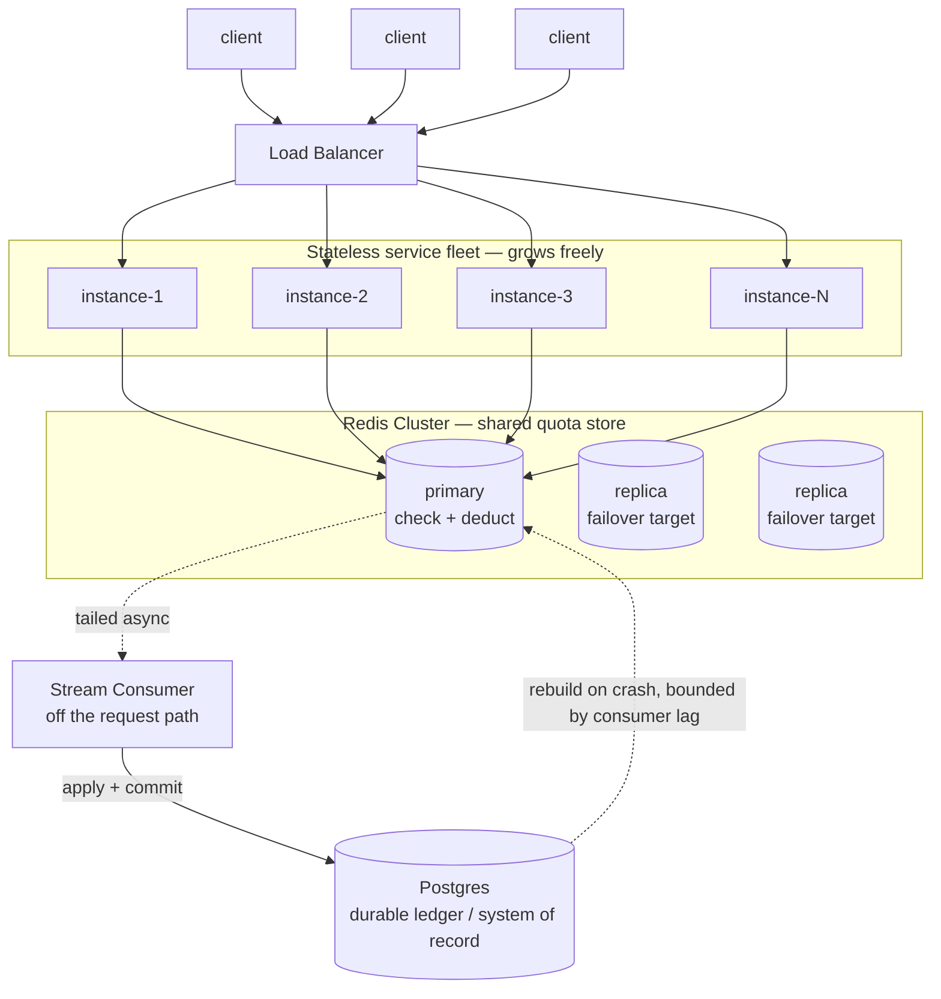

# DESIGN.md — Per-Customer Quota Metering

Decisions and tradeoffs, not a feature list. See `README.md` for what's implemented and
how to run it.

## Integration shape

| Option | Pros | Cons |
|---|---|---|
| Middleware | Transparent, no per-feature wiring | Can't know unit cost (`len(containerIds)`) without parsing the body — defeats the point |
| Standalone sidecar/service | Matches real scale-out shape | Extra network hop + deployable, unjustified at this scope |
| **Library, called from feature handlers (chosen)** | No network hop, unit cost known by the caller | Ties quota logic to in-process deployment (see state-sharing section) |

Quota logic (`service/services/quota.py`, `idempotency.py`) is called directly by
`service/services/track.py`, which backs `POST /v1/features/container-tracking/track`.
No generic public `/consume` endpoint — deduction only happens inside a feature handler.

**How quotas get configured:** set once, at org creation (`POST /v1/orgs`), server-side —
a client supplies `{feature, limit}` pairs, the server generates the `orgId` and derives
`anchorDay`. No admin CRUD, no update-limit endpoint. Chosen over a dynamic config service
because nothing in scope needs limits to change after creation, and a static row per
org × feature is exactly what the atomic deduct primitive already reads — adding a config
layer on top would mean a second source of truth to keep in sync with `quotas.quota_limit`
for no real requirement behind it. Static seed data (`org_demo`, etc.) exists purely so the
API is explorable without a setup step; it's not the configuration mechanism itself.

## Concurrent correctness

| Option | Pros | Cons |
|---|---|---|
| Read-then-write (`SELECT` used, check in app code, `UPDATE`) | Simple | Race: two concurrent requests both read stale `used`, both pass, both write → over-served |
| Deduct after downstream success | "Only charge for what worked" | Same race, later in the request |
| **Atomic conditional `UPDATE ... WHERE used + n <= limit RETURNING used` (chosen)** | Check + write is one indivisible statement, no race window | Correctness lives in SQLite/Postgres semantics, not app code — must be the same pattern everywhere (deduct, refund, idempotency) |

```sql
UPDATE quotas SET used = used + :units
WHERE org_id = :org_id AND feature = :feature
  AND period_start = :current_period_start AND used + :units <= quota_limit
RETURNING used;
```
Zero rows back = stale period or insufficient quota, nothing written either way.

**Caveat:** this build also wraps every call in a process-wide `threading.Lock` (required
because `:memory:` SQLite is scoped to one connection). The lock alone would already
prevent the race even with a naive read-then-write, so the concurrency tests prove the
*lock + atomic SQL together* — not that the SQL primitive alone is sufficient without the
lock (never tested with the lock removed). The atomic primitive is what carries the
guarantee once the lock disappears — multi-instance, or the Redis design below.

Proven under real `ThreadPoolExecutor` contention (`tests/concurrency/`) against a
nearly-exhausted quota, both against the primitive directly and through the full `/track`
HTTP stack: successful deductions never exceed `quota_limit`, final `used` is exact, no
negative `remaining` observed. Stable across repeated runs.

## How state is shared across instances

Target architecture: a **shared store all instances talk to** — Redis, with the same
atomic check-and-deduct guarantee as the SQL primitive above (a Lua script executes
single-threaded in Redis, so the atomicity carries over directly), backed by Postgres as
the durable system of record. Every instance in the fleet reads/writes the same counters,
so "instances come and go, per-instance counting is not acceptable" is a non-issue by
construction — there's no per-instance state to begin with. Full design in Scaling below.

This build stands in a single-process, single `:memory:` SQLite connection for that
shared store, using the identical atomic-`UPDATE` pattern the Redis Lua script would use
— same correctness mechanism, smaller footprint, no external dependency for a reviewer to
stand up. The tradeoff: it's correct within one process, but doesn't yet span multiple
fleet instances the way the target architecture does. Swapping the storage layer for
Redis (same primitive, shared backend) is the whole fix, not a redesign.

## Batch policy

| Option | Pros | Cons |
|---|---|---|
| Partial fulfillment (`deduct min(M,N)`) | Uses all available headroom | Which `M` of `N` containerIds get in is arbitrary — the server has no principled basis to choose, and the consumer now has to figure out which of its containers were actually accepted and build retry logic for exactly the leftover subset. Complexity pushed onto every caller. |
| **All-or-nothing (chosen)** | No selection ambiguity on the server. `429` response carries `remaining` and `requested` — the consumer knows exactly what fits and can retry with a smaller batch using its own logic (e.g. split in half, or send the first `remaining` containers). Server stays simple, consumer decides its own retry shape. | Wastes headroom that could've been used on the failed attempt |

The server never has to decide "which M" — that ambiguity is handed back to the caller,
who is in a much better position to decide how to split its own batch than the quota
component is. Contrast with the downstream-failure refund path, where the selection
*isn't* arbitrary — downstream reports exactly which items failed, so refunding exactly
those units is a principled decision, not a guess.

## Failure & retry handling

Deduct full batch up front (all-or-nothing), refund failed units after downstream runs.
Not deduct-after-success — same race as above.

**Idempotency key:** `requestId` (client-supplied, required — a client can't distinguish
"never arrived" from "succeeded, response lost," and retrying is correct behavior) +
payload fingerprint (hash of `feature+units+containerIds`) + `orgId`/`feature` as
verification fields.

| Lookup result | Behavior |
|---|---|
| Not found | Proceed, new request |
| Found, org/feature/hash all match | Return cached response, no re-deduction |
| Found, org/feature or hash mismatch | `409` — reject loudly instead of returning stale data for a different request |

**TTL 1 minute, lazy (checked on lookup, no sweep thread) — no legitimate caller re-tracks
the same containers with the same `requestId` within a minute.** This is the key
assumption the whole retry story rests on: a `requestId` reappearing inside that window is
treated as a retry of the *same* logical request, not a new one.

**Refund:** capped atomically (`units_refunded + amount <= units_deducted`), paired with
the `quotas.used` decrement under the same lock acquisition. Can't over-refund or
double-refund.

**Judgment call made during implementation, not pre-planned:** if `check_and_consume`
fails (insufficient quota / not found), no idempotency row is reserved — nothing was
deducted, so nothing to protect against double-charging. Lets a retry re-evaluate against
current state instead of replaying a stale rejection for the rest of the TTL window.

## Reset & reporting

| Option | Pros | Cons |
|---|---|---|
| Global calendar month | Simple, one reset for everyone | Unfair — org signing up on the 20th gets a partial first period |
| **Per-org anchor day (chosen)** | Fair, tied to an actual event (signup) | Global UTC only — per-org *day*, not per-org *timezone* |

`anchorDay` = day-of-month of org creation (UTC), immutable. Reset is lazy, not cron:
`period_start` compared against `current_period_start(anchorDay, now)` per request; stale
row rolls to `used=0` computed directly to the *correct* current period (multi-month gaps
roll to one fresh period, not compounding). `GET /v1/quota/usage` applies the same check
but never persists a rollover — a read must not mutate state.

## Real load-test numbers

`load_test/load_test.py` — real `asyncio`+`httpx` against a live `uvicorn` process, full
`/track` success path:

| concurrency | throughput (req/s) | p50 (ms) | p95 (ms) | p99 (ms) |
|---|---|---|---|---|
| 1  | 996.6  | 0.956  | 1.080   | 1.167   |
| 5  | 1262.8 | 2.997  | 3.199   | 6.218   |
| 10 | 633.7  | 10.499 | 12.559  | 15.110  |
| 20 | 461.5  | 37.700 | 90.557  | 119.127 |
| 30 | 402.1  | 52.634 | 201.328 | 292.676 |
| 50 | 411.7  | 80.966 | 347.984 | 479.046 |

At concurrency 1, full round trip is sub-millisecond — consistent with a direct
`check_and_consume`-only benchmark (500 calls, avg 0.013ms, `tests/performance/`),
confirming the *operation itself* is nowhere near the 10ms budget; the gap is ASGI/
Pydantic/network overhead.

Throughput **peaks at concurrency 5 (~1,260 req/s) then declines** as concurrency rises
further (p50 3ms → 81ms, concurrency 5 → 50) — lock-contention overhead growing faster
than the work being done, not any operation getting slower. Direct consequence of the
single-lock/single-instance limitation above.

Against the assignment's stated workload (~2,000 ops/sec sustained, peaking 10,000/sec):
this build's ~1,260 req/s peak falls short of even the sustained target, single process,
single dev machine.

**This degradation is a single-process, single-`threading.Lock` artifact, not a limit of
the approach itself.** The blowup past concurrency 5 comes from many Python threads
contending for one GIL-guarded mutex — that contention is specific to this build's
in-process stand-in for shared storage, not to atomic check-and-deduct as a technique.
Swapping in Redis (per Scaling below) removes that bottleneck entirely: Redis executes
each Lua script single-threaded in C, with no GIL and no Python-level lock for clients to
queue behind, so many concurrent connections can pipeline requests without the
super-linear contention cost seen here. Expect full round-trip latency under real
concurrent load to stay in the **low single digits (roughly 2-6ms)**, not the 80ms+ seen
at concurrency 50 today — comfortably inside the 10ms budget even under sustained load,
which this single-process build currently is not.

## Where this falls over

- Single-process only — doesn't span fleet instances (see Scaling for the fix).
- No persistence across restart (`:memory:` SQLite — deliberate, zero external deps for
  a reviewer to stand up, but state is lost on restart).
- Throughput ceiling below the stated sustained-load target (measured above).
- UTC-only, not true per-org timezone support.
- No admin CRUD for quota limits — set once at org creation.
- Fail-open/closed undecided in practice — no failure mode exists yet to enforce it against.

## Scaling to 50,000 orgs (not built)

Target architecture — not implemented, the current build runs the single-process design
described above. Solid arrows are the synchronous request path (sub-ms); dashed arrows
are the async durability path, off the request path entirely.



Every fleet instance talks to the *same* Redis cluster, so there's no per-instance state
to drift apart — unlike the current build, where each process holds its own private
counters. The atomic check-and-deduct stays on the request path; writing it durably to
Postgres does not, via a background consumer that tails the deduction stream and applies
events asynchronously.

- **Redis + Lua** as the shared hot-path engine — Lua scripts run single-threaded in
  Redis, same atomicity property as the SQL primitive, but shared across the fleet
  instead of scoped to one process. Fixes the state-sharing gap directly.
- **Postgres** stays system of record — Redis restart can lose writes (the exact
  over-serve risk being avoided), so durable state isn't trusted to Redis alone.
- **Sync:** same Lua script atomically appends a deduction event to a Redis Stream; a
  background consumer applies events to Postgres, acks only after Postgres confirms.
- **Recovery:** rebuild counters from Postgres, not memory. Honest gap: an event lost
  before the consumer drains it under-counts on rebuild — errs toward under-serving, not
  over-serving, but it's real, not "eventually consistent" hand-waving.
- **Cheaper lever before Redis:** quota rows partition naturally by `org_id` — try
  sharding Postgres first if the bottleneck is connection throughput, not latency.
- **Fail-open vs fail-closed** (open in original notes, doesn't surface today — no
  network dependency to fail against yet): decided **fail-closed** for the Redis future.
  "Never over-served" is the stated bar; block over serve un-metered.

## AI-assistance disclosure

**Defined by me, before implementation:**
- Tech stack — Python 3, FastAPI, stdlib `sqlite3`
- Swagger/OpenAPI for interactive docs
- Test-driven development workflow — tests written and reviewed before implementation
- MVC layering — `routes → controllers → services → repos`
- Initial project setup

**Key design decisions were mine; AI was used to research pros/cons of alternatives before
deciding:**
- 1-minute idempotency TTL, and treating the same `requestId` within that window as a retry
- Per-org anchor day for monthly reset, instead of a global calendar month
- All-or-nothing batch policy, instead of partial fulfillment
- Pre-deduct + compensating refund on downstream failure, instead of deduct-after-success
- Atomic conditional `UPDATE ... RETURNING` as the concurrency primitive, instead of
  read-then-write
- Payload fingerprint alongside `requestId`, to catch key reuse with a different payload
- `:memory:` SQLite, single connection + lock, as this build's storage
- Redis + Postgres as the target scale-out architecture

**Implementation:** most of the code (`service/`, tests, load-test script) was written by
AI (Claude Code) against the above. PRs were created via AI tooling at my direction,
reviewed and merged by me.
